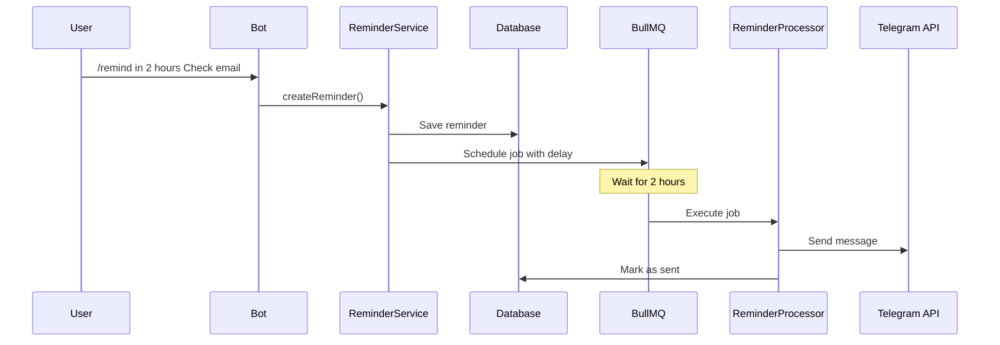

# Telegram Assistant Bot Documentation

## 📋 Tổng quan

Telegram Assistant Bot là một trợ lý cá nhân thông minh được tích hợp vào hệ thống Ecomate, giúp người dùng quản lý ghi chú, công việc, và nhắc nhở trực tiếp trong Telegram.

## 🎯 Tính năng chính

### 1. Ghi chú (Notes)
- Lưu nhanh các ghi chú quan trọng
- Tìm kiếm theo nội dung
- Hỗ trợ tags để phân loại

### 2. Công việc (Todos)
- Tạo danh sách công việc
- Đánh dấu hoàn thành
- Theo dõi deadline
- Phân loại độ ưu tiên (LOW, MEDIUM, HIGH, URGENT)

### 3. Nhắc nhở (Reminders)
- Đặt nhắc việc với ngôn ngữ tự nhiên
- Tự động gửi thông báo đúng thời gian
- Hỗ trợ BullMQ job queue cho độ tin cậy cao

### 4. Dịch thuật (Translation)
- Dịch văn bản nhanh chóng
- Tích hợp Cloudflare Workers AI
- Tự động phát hiện ngôn ngữ nguồn

## 🚀 Hướng dẫn thiết lập

### Bước 1: Tạo Bot trên Telegram

1. Mở Telegram và tìm [@BotFather](https://t.me/BotFather)
2. Gửi lệnh `/newbot`
3. Đặt tên cho bot (ví dụ: "My Personal Assistant")
4. Đặt username cho bot (phải kết thúc bằng `bot`, ví dụ: `my_assistant_bot`)
5. BotFather sẽ trả về **Bot Token** - lưu lại token này

### Bước 2: Cấu hình biến môi trường

Thêm các biến sau vào file `.env`:

```bash
# Telegram Bot Configuration
TELEGRAM_BOT_TOKEN=1234567890:ABCdefGHIjklMNOpqrsTUVwxyz  # Token từ BotFather
TELEGRAM_WEBHOOK_URL=https://your-railway-app.railway.app/v1/telegram/webhook
TELEGRAM_WEBHOOK_SECRET=$(node -e "console.log(require('crypto').randomBytes(32).toString('hex'))")
```

**Lưu ý quan trọng:**
- `TELEGRAM_WEBHOOK_URL` phải là HTTPS trong production (Railway tự động cung cấp HTTPS)
- `TELEGRAM_WEBHOOK_SECRET` nên được generate ngẫu nhiên để bảo mật

### Bước 3: Deploy lên Railway

1. Push code lên Git repository:
```bash
git add .
git commit -m "Add Telegram bot integration"
git push origin main
```

2. Trên Railway Dashboard:
   - Vào **Variables** tab
   - Thêm các biến môi trường Telegram
   - Railway sẽ tự động redeploy

3. Lấy URL của Railway app:
   - Format: `https://your-project-name.railway.app`
   - Cập nhật `TELEGRAM_WEBHOOK_URL` nếu cần

### Bước 4: Kiểm tra hoạt động

1. Mở Telegram và tìm bot của bạn (theo username đã tạo)
2. Gửi lệnh `/start`
3. Bot sẽ phản hồi với tin nhắn chào mừng
4. Thử các lệnh khác như `/note`, `/todo`, `/help`

## 📱 Danh sách lệnh

### Lệnh cơ bản

| Lệnh | Mô tả | Ví dụ |
|------|-------|-------|
| `/start` | Khởi động bot và đăng ký user | `/start` |
| `/help` | Hiển thị hướng dẫn sử dụng | `/help` |

### Quản lý ghi chú

| Lệnh | Mô tả | Ví dụ |
|------|-------|-------|
| `/note <text>` | Lưu một ghi chú mới | `/note Remember to buy milk` |
| `/list` | Hiển thị ghi chú gần đây | `/list` |

### Quản lý công việc

| Lệnh | Mô tả | Ví dụ |
|------|-------|-------|
| `/todo <task>` | Thêm công việc mới | `/todo Finish project report` |
| `/list` | Hiển thị todos đang active | `/list` |

### Nhắc nhở

| Lệnh | Mô tả | Ví dụ |
|------|-------|-------|
| `/remind <time> <message>` | Đặt nhắc việc | `/remind tomorrow at 9am Take medicine` |
| | | `/remind in 2 hours Check email` |
| | | `/remind next Monday Call John` |
| `/list` | Hiển thị nhắc nhở sắp tới | `/list` |

### Dịch thuật

| Lệnh | Mô tả | Ví dụ |
|------|-------|-------|
| `/translate <text>` | Dịch văn bản | `/translate Hello, how are you?` |

## 🏗️ Kiến trúc kỹ thuật

### Cấu trúc thư mục

```
src/modules/telegram-bot/
├── interfaces/
│   ├── telegram.interface.ts    # Telegram types
│   ├── command.interface.ts     # Command definitions
│   └── job.interface.ts         # BullMQ job types
├── services/
│   ├── command.service.ts       # Command handlers
│   ├── note.service.ts          # Note CRUD
│   ├── todo.service.ts          # Todo CRUD
│   ├── reminder.service.ts      # Reminder scheduling
│   └── user-binding.service.ts  # User management
├── processors/
│   └── reminder.processor.ts    # BullMQ reminder worker
├── telegram-bot.service.ts      # Bot initialization
├── telegram-bot.controller.ts   # Webhook endpoint
└── telegram-bot.module.ts       # Module definition
```

### Database Schema

#### TelegramUser
```prisma
model TelegramUser {
  id                    String    @id @default(cuid())
  telegramUserId        BigInt    @unique
  telegramUsername      String?
  telegramFirstName     String?
  telegramLastName      String?
  userId                String?   @unique
  status                TelegramUserStatus
  language              String    @default("en")
  timezone              String    @default("UTC")
  notificationsEnabled  Boolean   @default(true)
  notes                 TelegramNote[]
  todos                 TelegramTodo[]
  reminders             TelegramReminder[]
}
```

#### TelegramNote
```prisma
model TelegramNote {
  id                    String    @id @default(cuid())
  telegramUserId        BigInt
  content               String
  tags                  String[]  @default([])
  createdAt             DateTime  @default(now())
  updatedAt             DateTime  @updatedAt
}
```

#### TelegramTodo
```prisma
model TelegramTodo {
  id                    String    @id @default(cuid())
  telegramUserId        BigInt
  content               String
  completed             Boolean   @default(false)
  dueDate               DateTime?
  priority              TodoPriority
  createdAt             DateTime  @default(now())
}
```

#### TelegramReminder
```prisma
model TelegramReminder {
  id                    String    @id @default(cuid())
  telegramUserId        BigInt
  message               String
  remindAt              DateTime
  status                ReminderStatus
  sentAt                DateTime?
}
```

### Job Queue Flow



## 🔒 Bảo mật

### Webhook Security

Bot sử dụng nhiều lớp bảo mật:

1. **Secret Token**: Telegram gửi header `X-Telegram-Bot-Api-Secret-Token`
2. **URL Secret Path**: Webhook URL chứa secret path `/telegram/webhook/<secret>`
3. **Request Validation**: Middleware kiểm tra user blocked/banned

### Rate Limiting

Có thể thêm rate limiting bằng cách sử dụng middleware trong `telegram-bot.service.ts`.

### User Blocking

Quản trị viên có thể block user:

```typescript
await userBindingService.blockUser(telegramUserId);
```

## 🛠️ Development

### Local Development

1. Start dependencies:
```bash
docker-compose up -d postgres redis
```

2. Set environment variables:
```bash
export TELEGRAM_BOT_TOKEN=your-test-bot-token
export TELEGRAM_WEBHOOK_URL=https://your-ngrok-url.ngrok.io/v1/telegram/webhook
```

3. Use ngrok for local webhook testing:
```bash
ngrok http 3000
```

4. Start the app:
```bash
npm run start:dev
```

### Testing Commands

Use Telegram app to test commands directly with your bot.

### Debugging

Enable debug logs:
```bash
LOG_LEVEL=debug npm run start:dev
```

Check BullMQ queue status:
```typescript
const queue = await reminderQueue.getJobCounts();
console.log(queue); // { waiting: 0, active: 1, completed: 10, failed: 0 }
```

## 📊 Monitoring

### Health Check

Endpoint: `POST /telegram/health`

Response:
```json
{
  "status": "ok",
  "bot": {
    "id": 1234567890,
    "username": "my_assistant_bot",
    "first_name": "My Personal Assistant"
  }
}
```

### Logs

Bot ghi log tất cả các hoạt động quan trọng:
- User interactions
- Command executions
- Job processing
- Errors

Xem logs trên Railway:
```bash
railway logs
```

## 🚧 Troubleshooting

### ❌ Error 401 - Unauthorized

**Nguyên nhân có thể:**
- Bot token invalid hoặc expired
- Webhook chưa được set đúng
- Database không kết nối được
- User không được tạo trong database

**Cách kiểm tra:**

1. **Verify bot token:**
```bash
curl https://api.telegram.org/bot<YOUR_TOKEN>/getMe
```
Nếu trả về thông tin bot → Token valid
Nếu trả về 401 → Token invalid, cần tạo lại bot

2. **Kiểm tra webhook:**
```bash
curl https://api.telegram.org/bot<YOUR_TOKEN>/getWebhookInfo
```
Đảm bảo:
- `url` có format: `https://your-domain.com/v1/telegram/webhook/<secret>`
- `has_custom_certificate`: false
- `pending_update_count`: 0 hoặc thấp
- Không có `last_error_message`

3. **Xem Railway logs:**
```bash
railway logs --tail 100
```
Tìm các dòng log:
- `✓ Database connection successful`
- `✓ TelegramUser table exists`
- `Creating new Telegram user: <id>`
- `User binding failed` (nếu có lỗi)

4. **Test database connection:**
Vào Railway dashboard → PostgreSQL → Connect
```sql
-- Check if table exists
SELECT tablename FROM pg_tables WHERE tablename = 'TelegramUser';

-- Check users
SELECT "telegramUserId", "telegramUsername", "status", "createdAt"
FROM "TelegramUser"
ORDER BY "createdAt" DESC LIMIT 10;
```

**Giải pháp:**

1. **Nếu bot token invalid:**
   - Tạo bot mới trên @BotFather: `/newbot`
   - Update `TELEGRAM_BOT_TOKEN` trên Railway
   - Restart app

2. **Nếu webhook sai:**
   - Update `TELEGRAM_WEBHOOK_URL` thành: `https://your-app.railway.app/v1/telegram/webhook`
   - Restart app (webhook sẽ tự động được set lại)

3. **Nếu database lỗi:**
   - Check `DATABASE_URL` có đúng không
   - Run migrations: `npx prisma db push`
   - Restart app

4. **Nếu user không được tạo:**
   - Xem logs để biết lỗi cụ thể
   - Thử gửi `/start` lại
   - Check database constraints

### Bot không nhận tin nhắn

1. Kiểm tra webhook đã được set chưa:
```bash
curl https://api.telegram.org/bot<TOKEN>/getWebhookInfo
```

2. Kiểm tra webhook URL có HTTPS và accessible không

3. Kiểm tra logs xem có lỗi gì không

4. Verify prefix `/v1` có trong webhook URL không

### ❌ Registration Failed Error

Khi user nhận message: "Registration failed. Our database might be temporarily unavailable"

**Nguyên nhân:**
- Database connection bị mất
- TelegramUser table chưa tồn tại
- Database constraint violations

**Giải pháp:**
1. Check Railway logs để xem error cụ thể
2. Verify database migrations đã chạy:
```bash
npx prisma db push
```
3. Check PostgreSQL service trên Railway có đang chạy không
4. Restart app nếu cần

### Reminder không được gửi

1. Kiểm tra Redis connection
2. Kiểm tra BullMQ queue status
3. Xem logs của ReminderProcessor
4. Verify reminder được tạo trong database

### Translation không hoạt động

1. Kiểm tra `CLOUDFLARE_WORKER_AI_URL` đã được set chưa
2. Test TranslationService trực tiếp
3. Xem logs của TranslationModule

### ⚙️ Debugging Commands

**Check bot status:**
```bash
# Get bot info
curl https://api.telegram.org/bot<TOKEN>/getMe

# Get webhook info
curl https://api.telegram.org/bot<TOKEN>/getWebhookInfo

# Delete webhook (if needed)
curl https://api.telegram.org/bot<TOKEN>/deleteWebhook
```

**Railway commands:**
```bash
# View logs
railway logs --tail 100

# View logs with filter
railway logs | grep "Telegram"

# Check environment variables
railway vars

# Restart service
railway up --detach
```

**Database queries:**
```sql
-- Count users by status
SELECT status, COUNT(*)
FROM "TelegramUser"
GROUP BY status;

-- Recent user activity
SELECT "telegramUserId", "telegramUsername", "lastInteractionAt"
FROM "TelegramUser"
WHERE "lastInteractionAt" IS NOT NULL
ORDER BY "lastInteractionAt" DESC
LIMIT 10;

-- Check for blocked users
SELECT * FROM "TelegramUser" WHERE status = 'BLOCKED';
```

## 🔮 Tính năng tương lai

- [ ] Recurring reminders (daily/weekly/monthly)
- [ ] Voice message support (Whisper AI)
- [ ] Image recognition
- [ ] Smart suggestions based on usage patterns
- [ ] Todo completion tracking & statistics
- [ ] Export data to CSV/JSON
- [ ] Multi-language support
- [ ] Integration with calendar apps
- [ ] Collaborative notes/todos (share with other users)

## 📚 Tài liệu tham khảo

- [grammY Documentation](https://grammy.dev)
- [Telegram Bot API](https://core.telegram.org/bots/api)
- [BullMQ Documentation](https://docs.bullmq.io)
- [Chrono Node](https://github.com/wanasit/chrono) - Natural language date parsing

## 📄 License

This project is part of the Ecomate platform.

---

**Tác giả:** Ecomate Team
**Ngày tạo:** 2025-01-29
**Phiên bản:** 1.0.0
